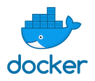

## Pay as you go inference with AWS Lambda (Container Image Support)
 

This repository contains resources to help you deploy Lambda Functions based on [Docker Images](https://aws.amazon.com/blogs/aws/new-for-aws-lambda-container-image-support/). 

## Overview

AWS Lambda is one of the most cost-effective service that lets you run code without provisioning or managing servers. 

It offers many advantages when working with serverless infrastructure. When you break down the logic of your machine learning service into a single Lambda function for a single request, things become much simpler and easy to scale. 

You can forget all about the resource handling needed for the parallel requests coming into your model. 

**If your usage is sparse and tolerable to a higher latency, Lambda is a great choice among various solutions.**